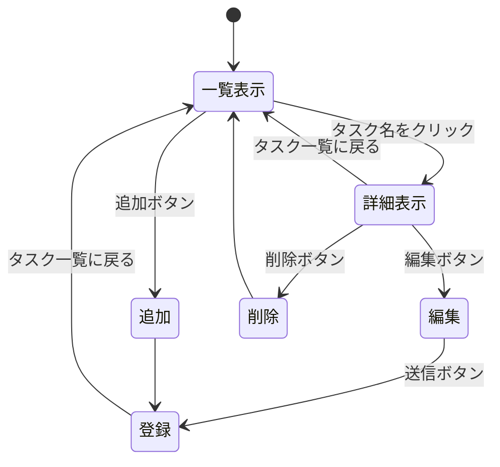
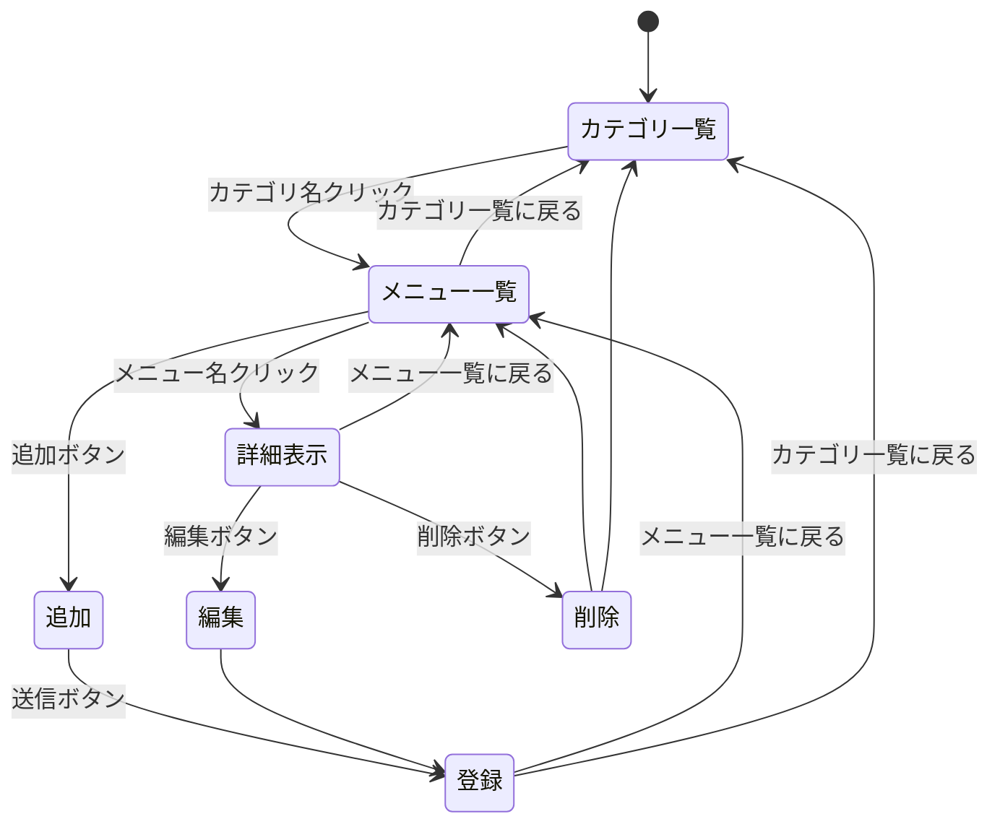
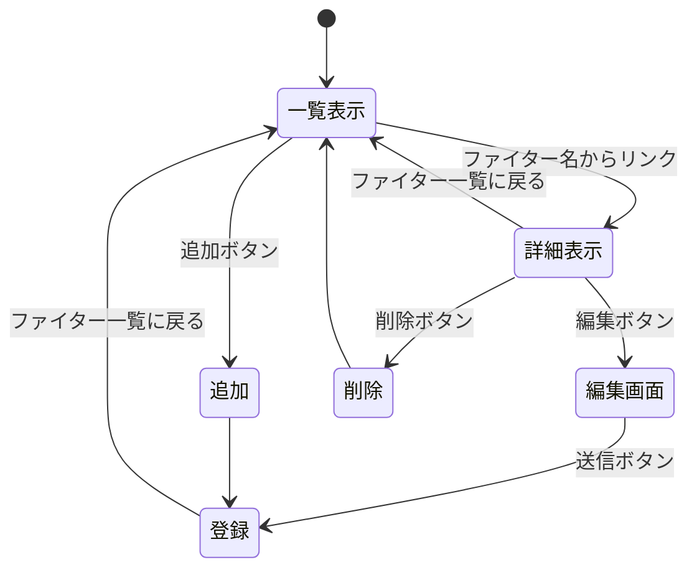

# 開発者用仕様書（仮）

## 1つ目　ToDoリスト

###　データ構造
#### ToDoリストの構造
* 機能
    * 完了したタスクの一覧を保つ
* 構造
    * id : number （ID）
    * task : string （タスクの内容）
    * done : boolean　（タスクの完了状態：trueかfalse）
###　ページ遷移
目的 | リソース名 | HTTPメソッド | 遷移先 |
-|-|-|-|
一覧表示 | /todo | GET | todo.ejs
追加 | /todo | POST | /todo
詳細表示 | /todo/:id | GET | todo_detail.ejs
編集 | /todo/edit/:id | GET | todo_edit.ejs
更新 | /todo/update/:id | POST | /todo
削除 | /todo/delete/:id | GET/POST | /todo

### ページ遷移図

##　2つ目　はま寿司のメニュー一覧

###　データ構造
メニュー情報を配列として定義する．ランディングページに表示するメニュー（/hama_menu）とその詳細の（/hama_limited）などに分けている．
#### hama_menuのカテゴリ
* 機能
    * ランディングページに表示されるカテゴリ一覧表示
* 構造
    * id : number （ID）
    * tag : string （例：期間限定，にぎりなど）

#### hama_limited,hama_nigiriなどの詳細カテゴリ
* 機能
    * 具体的なメニュー一覧表示
* 構造
    * id : number （ID）
    * name : string （メニュー名→　例：厳選まぐろ中とろ）
    * price : string （価格→　例：110円（税込））
    * suuryou : string （数量→　例：1貫）
    * omochikaeri : string （お持ち帰りの可否→　例：お持ち帰り可）

###　ページ遷移
目的 | リソース名 | HTTPメソッド | 遷移先 
-|-|-|-|
カテゴリ一覧 | /menu | GET | hama_menu.ejs 
メニュー一覧 | /menu/:tag | GET | hama_menu_list.ejs 
追加フォーム | /menu/:tag/create | GET | hama_menu_new.html 
新規追加 | /menu/:tag | POST | /menu/:tag 
詳細表示 | /menu/:tag/:id | GET | hama_menu_detail.ejs
編集 | /menu/:tag/:id/edit | GET | ham_menu_edit.ejs
更新 | /menu/:tag/:id | POST | /menu/:tag
削除 | /menu/:tag/:id/delete | GET | /menu/:tag

<!-- 期間限定 | /limited_menu | GET | hama_limited.ejs
にぎり | /nigiri | GET | hama_nigiri.ejs
肉握り | /niku_nigiri | GET | hama_niku_nigiri.ejs
軍艦・細巻き・その他 | /gunkan_hosomaki_sonota | GET | hama_gunkan.ejs
贅沢握り・三種盛り | /zeitaku_sanshu | GET | hama_zeitaku.ejs
至福の一貫 | /shifuku_no_ikkan | GET | hama_shifuku.ejs
サイドメニュー | /side_menu | GET | hama_side.ejs
デザート・ドリンク | /dessert_drink | GET | hama_dessert.ejs
アルコール | /alcohol | GET | hama_alcohol.ejs
はまっこセット | /kids_menu | GET | hama_kids.ejs -->
<!-- * CRUDに則って作成できていないため，どの部分にそれを使うか検討中:thinking: -->

### ページ遷移図

##　3つ目　大乱闘スマッシュブラザーズに登場するキャラクター一覧

###　データ構造
ファイター情報を配列として定義する．大乱闘スマッシュブラザーズに登場するキャラクターの名称がランディングページに表示される．
#### sumabura_dataの構造
* 機能
    * キャラクターの情報を保持
* 構造
    * id : number か string （ID）
    * name : string （キャラクター名→　例：マリオ）
    * series : string （登場シリーズ→　例：スーパーマリオ）
    * nannido : string （VIP到達難易度→　例：★★★★☆）
###　ページ遷移
目的 | リソース名 | HTTPメソッド | 遷移先 |
-|-|-|-|
一覧表示 | /sumabura | GET | sumabura.ejs
追加フォーム | /sumabura/create | GET | /public/sumabura_new.html
詳細表示 | /sumabura/:number | GET | sumabura_detail.ejs
追加 | /sumabura | POST | /sumabura
編集画面 | /sumabura/edit/:number | GET | sumabura_edit.ejs
更新 | /sumabura/update/:number | POST | /sumabura
削除 | /sumabura/delete/:number | GET | /sumabura

### ページ遷移図

