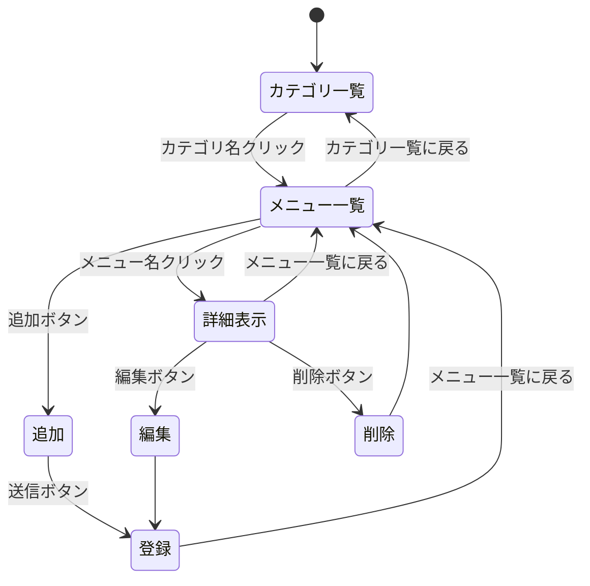
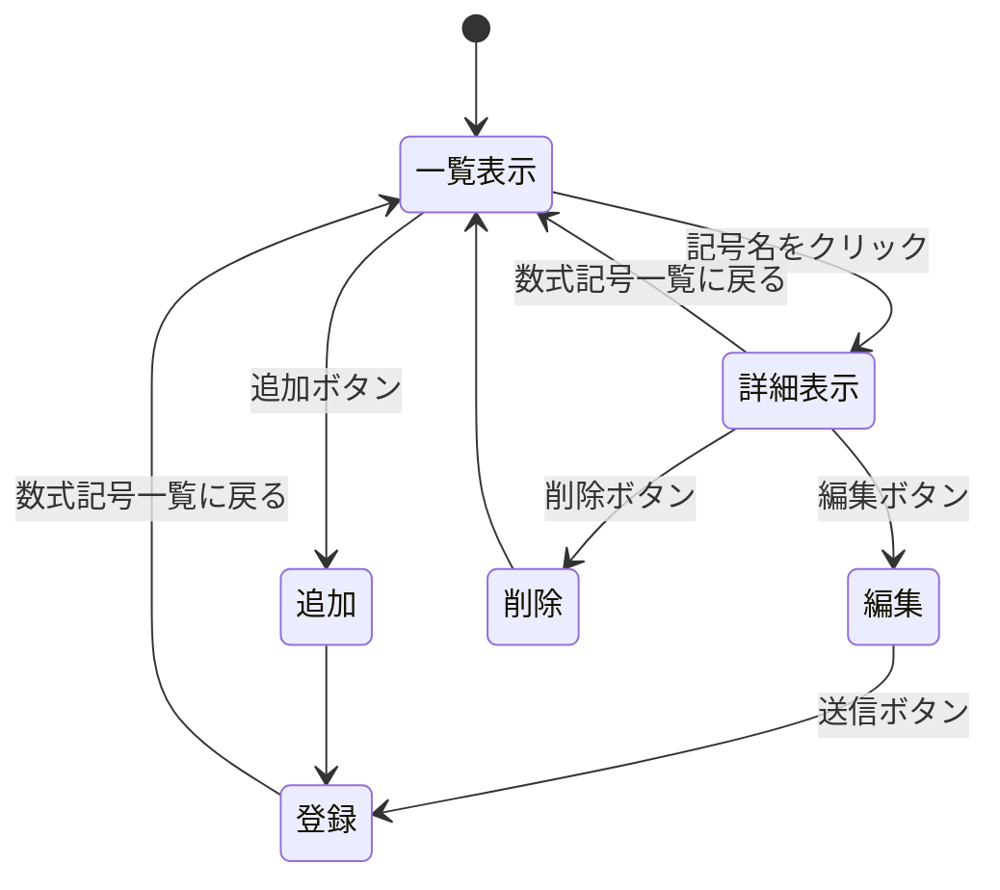
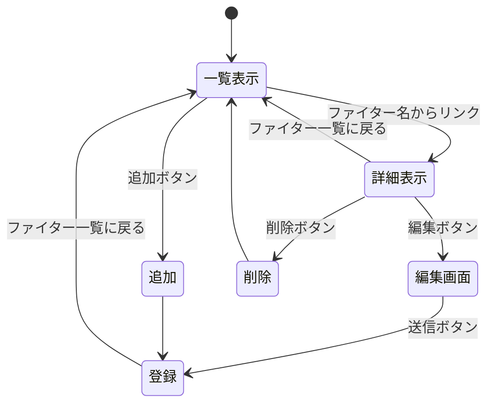

# 開発者用仕様書（仮）

##　1つ目　はま寿司のメニュー一覧

###　データ構造
メニュー情報を配列として定義する．ランディングページに表示するメニュー（/hama_menu）とその詳細の（/hama_limited）などに分けている．
#### hama_menuのカテゴリ
* 機能
    * ランディングページに表示されるカテゴリ一覧表示
* 構造
    * id : number （ID）
    * url : string （例：limited_menu，nigiriなど）
    * tag : string （例：期間限定，にぎりなど）

#### hama_limited,hama_nigiriなどの詳細カテゴリ
* 機能
    * 具体的なメニュー一覧表示
* 構造
    * id : number （ID）
    * name : string （メニュー名→　例：厳選まぐろ中とろ）
    * price : string （価格→　例：110円（税込））
    * suuryou : string （数量→　例：1貫）
    * omochikaeri : string （お持ち帰りの可否→　例：お持ち帰り可）

###　ページ遷移
目的 | リソース名 | HTTPメソッド | 遷移先 
-|-|-|-|
カテゴリ一覧 | /menu | GET | hama.ejs 
メニュー一覧 | /menu/:url | GET | hama_menu.ejs 
追加フォーム | /menu/:url/create | GET | hama_menu_new.html 
新規追加 | /menu/:url/create | POST | /menu/:url 
詳細表示 | /menu/:url/:number | GET | hama_menu_detail.ejs
編集 | /menu/:url/edit/:number | GET | hama_menu_edit.ejs
更新 | /menu/:url/update/:number | POST | /menu/:url
削除 | /menu/:url/delete/:number | GET | /menu/:url

### ページ遷移図

## 2つ目　tex数学記号一覧

###　データ構造
#### tex数学記号一覧の構造
* 機能
    * texで使うことができる数学記号を参照できる
* 構造
    * id : number （ID）
    * symbol : string （どのような記号の種類かを示す　例：=，≠など）
    * name : string （記号の名称　例：等号，不等号など）
    * command : string　（texでどのようなコマンドを使えば出力されるか　例:=，\neq"など）
    * genre : string （どのようなジャンルで数式記号を使えるか　例:等号，不等号，演算子など）
    * mean : string （その記号がどのような意味を持つか　例：等しいことを示す，等しくないことを示す，など）
###　ページ遷移
目的 | リソース名 | HTTPメソッド | 遷移先 |
-|-|-|-|
一覧表示 | /tex | GET | tex.ejs
追加 | /tex | POST | /tex
詳細表示 | /tex/:number | GET | tex_detail.ejs
編集 | /tex/edit/:number | GET | tex_edit.ejs
更新 | /tex/update/:number | POST | /tex
削除 | /tex/delete/:number | GET| /tex

### ページ遷移図

##　3つ目　大乱闘スマッシュブラザーズに登場するキャラクター一覧

###　データ構造
ファイター情報を配列として定義する．大乱闘スマッシュブラザーズに登場するキャラクターの名称がランディングページに表示される．
#### sumabura_dataの構造
* 機能
    * キャラクターの情報を保持
* 構造
    * id : number か string （ID）
    * name : string （キャラクター名→　例：マリオ）
    * series : string （登場シリーズ→　例：スーパーマリオ）
    * nannido : string （VIP到達難易度→　例：★★★★☆）
###　ページ遷移
目的 | リソース名 | HTTPメソッド | 遷移先 |
-|-|-|-|
一覧表示 | /sumabura | GET | sumabura.ejs
追加フォーム | /sumabura/create | GET | /public/sumabura_new.html
詳細表示 | /sumabura/:number | GET | sumabura_detail.ejs
追加 | /sumabura | POST | /sumabura
編集画面 | /sumabura/edit/:number | GET | sumabura_edit.ejs
更新 | /sumabura/update/:number | POST | /sumabura
削除 | /sumabura/delete/:number | GET | /sumabura

### ページ遷移図

